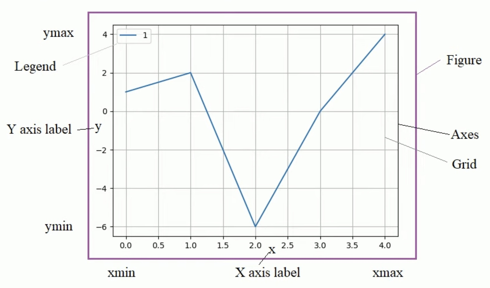

# Краткий гайд по графикам в питоне

## Установка
Для утсановки необходимо установить расширение Python и библиотеку matplotlib. Последняя устанавливается командой:

```bash
sudo apt install pip
pip install matplotlib
```

Теперь необходимо выбрать интерпретатор командой через строку VScode: 

`Ctrl+shift+P`  

`Python: select interpreter`

## Основные команды 
Для работы с графикой необходимо добавит библиотеку:

```Python
import numpy as np              #работа с данными для графика
import matplotlib
import matplotlib.pyplot as plt #работа с самим графиком

y = np.array([1, 2, -6, 0])     #лучше создавать массивы numpy
plt.plot([1, 2, -6, 0])
plt.show()                      #необходимо для показа графика
```

## Элементы окна



## Команды plot
В функцию plot можно подавать два массива: координаты по Х и координаты по Y

```Python
y = np.array([1, 2, -6, 0])
x = np.array([-1, -2, -3, -4])  
plt.plot(x, y)                  #массивы должны быть одного размера
```

Plot последовательно соединяет поданные точки.

Сетка на графике:

```Python
plt.grid() #включение сетки
```

Если необходимо отобразить несколько графиков в одном окнеБ то необходимо подать 4 массива:

```Python
y2 = [0, 1, 2, 3]
x2 = [i + 1 for i in y2] #печаатем i + 1 при этом i берется из y2

plt.plot(x, y, x2, y2)
```

Если еще раз вызвать plt.plot, то график отобразится на те же оси.

Также третьим аргументом функции plot может служить указание типа линии для графика:

```Python
plt.plot(x, y, '--')
```

Для добавления надписей на графике необходимо обратиться к соответствующим метоам:

```Python
plt.title('Result')   
plt.xlabel('Names')   
plt.ylabel('Marks')  
```

Построение точек на графике:

```Python
plt.scatter(x, y) #строит точки по массивам координат
```

Больше информации здесь http://cs.mipt.ru/python/lessons/lab1.html

## Управление объектом графика
Функция plot возвращает объект, построенный на графике. Им можно управлять после построения:

```Python
lines = plt.plot(x, y)
print(lines)
plt.setp(lines, linestyle='-.r') #так можно изменять цвет
plt.setp(lines, linestyle='0')   #поменяли отображение точек
```

## Анализ данных
Для приближения экспериментальных данных можно использовать функцию `polyfit()`:

```Python
theta = np.polyfit(X, y, 1)

print(f'The parameters of the line: {theta}')

y_line = theta[1] + theta[0] * X
```

Чтобы узнать отклонение можно воспользоваться функцией `r2_score()`

```Python
from sklearn.metrics import r2_score
r2_score(y, predict(x)
```